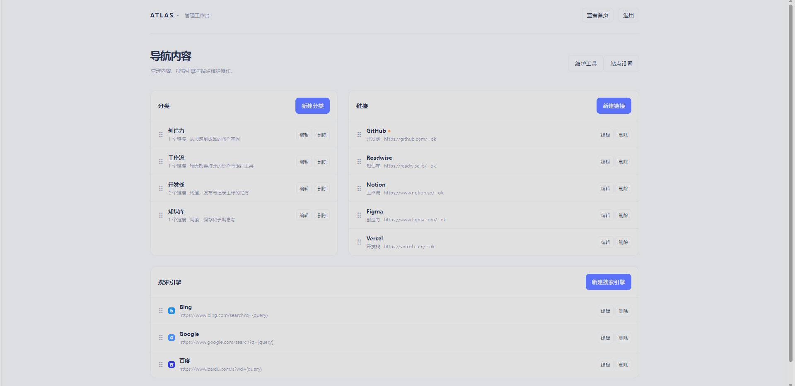

# Atlas Nav

> 一个本地优先、轻量可配置的个人导航工作台。

Atlas Nav 将常用服务、个人书签和搜索入口集中在一个精致首页，并提供单管理员后台管理分类、链接、搜索引擎、页面内容和视觉令牌。默认以 SQLite 运行，不需要 Docker，适合本地使用，也可在个人服务器上以 Node.js 服务部署。

首次启动时会显示与首页风格一致的数据库配置向导，可选择 SQLite、PostgreSQL、MySQL 或 MongoDB，并填写数据库地址、端口、数据库名、账号和密码。SQLite 默认路径为 `./data/atlas-nav.db`；关系数据库默认端口为 PostgreSQL `5432`、MySQL `3306`。首次初始化还需要从服务器日志复制一次性 `Atlas Nav setup token`，防止未授权用户抢先接管新实例。配置完成后，连接凭据保存在被 Git 忽略的 `.atlas-nav.config.json`，管理员密码只以哈希形式保存，初始化页面不再显示。

## 制作方式

本项目主要通过 Vibe Coding 完成：由人类提出产品目标、审查方案、运行验证并维护发布结果，AI 辅助完成代码实现、测试和文档整理。当前主要使用 `GPT-5.6-sol` 与 `GPT-5.6-terra` 协作完成。项目欢迎使用 Claude 或其他 AI 工具参与后续贡献；所有贡献者仍需对提交内容负责，并完成必要的安全审查、测试和许可证确认。

## 预览

| 首页 | 后台 |
| --- | --- |
|  |  |

## 主要功能

- 分类、链接、置顶入口与最近访问记录。
- 本站搜索、链接别名搜索，以及可在后台自由管理的外部搜索引擎。
- 标准、紧凑、分栏三种首页排布；深浅模式与中英文切换。
- 后台管理分类、链接、搜索引擎、站点名称、Logo URL、页脚文案与视觉令牌。
- JSON 导入导出、链接健康检查、网站元数据抓取与管理员密码更新。
- PWA 静态资源与最后一次导航数据缓存。
- URL 抓取的 DNS 私网校验、重定向复检、登录失败限流及受限输入校验。

## 快速开始

要求 Node.js 22.5+。Windows 下可直接双击 `start.cmd` 启动；首次运行时请先复制 `.env.example` 为 `.env`，再设置 `ADMIN_PASSWORD` 与 `SESSION_SECRET`。

或者手动执行：

```bash
cp .env.example .env
# 编辑 .env，设置 ADMIN_PASSWORD 与 SESSION_SECRET
npm install
npm run dev
```

访问 `http://localhost:3000`，后台位于 `http://localhost:3000/admin`。

默认数据使用 SQLite，文件位于 `data/atlas-nav.db`；上传图标位于 `storage/`。二者都属于私有数据，请备份且不要提交到 Git。

## 配置与文档

后台“站点设置”支持编辑页面文案、默认布局、语言、搜索引擎、会话天数和视觉令牌。视觉令牌只接受受控颜色和尺寸格式，避免任意 CSS 注入。

更多信息：

- [代码与配置说明](ARCHITECTURE.md)
- [贡献说明](CONTRIBUTING.md)
- [安全说明](SECURITY.md)

## Ubuntu / Debian 部署

以下命令假设服务器用户有 `sudo` 权限，仓库 URL 为 `https://github.com/uuuu1415/atlas-nav.git`。Atlas Nav 不需要 Docker。

### 一键部署

下面的命令会安装 Node.js 24、询问安装位置、服务端口、后台管理员用户名和密码，创建专用系统用户，克隆或 fast-forward 更新仓库，安装依赖并配置 systemd。执行过程中会隐藏管理员密码输入；已有 `.env`、`data/` 和 `storage/` 不会被覆盖。

交互式默认值：

- 安装位置：`/opt/atlas-nav`
- 服务端口：`3000`
- 后台管理员用户名：`admin`
- 后台管理员密码：`123456`

密码 `123456` 仅作为首次安装默认值，安全性很低。首次登录后台后，请立即使用“维护工具”修改为至少 10 个字符的强密码。已有 `.env` 时，脚本会保留原配置，不会用这些默认值覆盖现有账号。

首次启动向导还会要求初始化令牌。令牌只显示在服务端启动日志中，不会显示在网页中；请在同一台服务器上查看 `journalctl -u atlas-nav` 或启动终端后粘贴。不要把令牌发给其他人。

官方链接（推荐）：

```bash
curl -fsSL https://raw.githubusercontent.com/uuuu1415/atlas-nav/main/deploy/install.sh | sudo bash
```

镜像链接（jsDelivr）：

```bash
curl -fsSL https://cdn.jsdelivr.net/gh/uuuu1415/atlas-nav@main/deploy/install.sh | sudo bash
```

上面的镜像只用于下载一键安装脚本。无论使用哪个入口，脚本默认仍通过官方地址 `https://github.com/uuuu1415/atlas-nav.git` 克隆项目；Node.js 依赖安装源仍使用官方 NodeSource 地址。生产环境优先使用官方链接，镜像可能存在缓存延迟。

可选环境变量：

```bash
curl -fsSL https://raw.githubusercontent.com/uuuu1415/atlas-nav/main/deploy/install.sh | sudo env \
  ATLAS_APP_DIR=/opt/atlas-nav \
  ATLAS_USER=atlasnav \
  ATLAS_PORT=3000 \
  ATLAS_ADMIN_USERNAME=admin \
  bash
```

通过环境变量传入管理员密码不推荐，因为它可能出现在 shell 历史或进程环境中；默认交互式输入更安全。脚本完成后再按下面的 Nginx/HTTPS 配置公开服务。

```bash
sudo apt update
sudo apt install -y curl git ca-certificates build-essential
curl -fsSL https://deb.nodesource.com/setup_24.x | sudo -E bash -
sudo apt install -y nodejs
node --version
npm --version

sudo mkdir -p /opt/atlas-nav
sudo chown $USER:$USER /opt/atlas-nav
git clone https://github.com/uuuu1415/atlas-nav.git /opt/atlas-nav
cd /opt/atlas-nav
cp .env.example .env
nano .env
npm ci
npm start
```

`.env` 至少需要设置以下内容。请自行生成强随机密码和长随机字符串，不要直接使用示例值：

```dotenv
NODE_ENV=production
PORT=3000
DB_PROVIDER=sqlite
SQLITE_PATH=./data/atlas-nav.db
ADMIN_USERNAME=你的管理员用户名
ADMIN_PASSWORD=强随机密码
SESSION_SECRET=长随机字符串
```

确认 `http://服务器IP:3000` 可以访问后，创建 systemd 服务。将 `<LINUX_USER>` 替换为实际 Linux 用户：

```bash
sudo tee /etc/systemd/system/atlas-nav.service >/dev/null <<'EOF'
[Unit]
Description=Atlas Nav
After=network.target

[Service]
Type=simple
User=<LINUX_USER>
WorkingDirectory=/opt/atlas-nav
Environment=NODE_ENV=production
ExecStart=/usr/bin/npm start
Restart=always
RestartSec=5

[Install]
WantedBy=multi-user.target
EOF

sudo systemctl daemon-reload
sudo systemctl enable --now atlas-nav
sudo systemctl status atlas-nav --no-pager
```

安装 Nginx 和 Certbot：

```bash
sudo apt install -y nginx certbot python3-certbot-nginx
```

创建 `/etc/nginx/sites-available/atlas-nav`，将 `<YOUR_DOMAIN>` 替换为域名：

```nginx
server {
    listen 80;
    server_name <YOUR_DOMAIN>;

    client_max_body_size 2m;

    location / {
        proxy_pass http://127.0.0.1:3000;
        proxy_http_version 1.1;
        proxy_set_header Host $host;
        proxy_set_header X-Real-IP $remote_addr;
        proxy_set_header X-Forwarded-For $proxy_add_x_forwarded_for;
        proxy_set_header X-Forwarded-Proto $scheme;
    }
}
```

启用站点并签发 HTTPS 证书：

```bash
sudo ln -s /etc/nginx/sites-available/atlas-nav /etc/nginx/sites-enabled/atlas-nav
sudo nginx -t
sudo systemctl reload nginx
sudo certbot --nginx -d <YOUR_DOMAIN>
```

更新应用：

```bash
cd /opt/atlas-nav
git pull --ff-only
npm ci
sudo systemctl restart atlas-nav
```

在低访问时段备份私有数据和配置：

```bash
sudo systemctl stop atlas-nav
tar -czf atlas-nav-backup-$(date +%F).tar.gz /opt/atlas-nav/data /opt/atlas-nav/storage /opt/atlas-nav/.env /opt/atlas-nav/.atlas-nav.config.json
sudo systemctl start atlas-nav
```

备份文件包含管理员配置和私人导航数据，应加密保存，不要提交到 Git 或放在网站公开目录。

## 数据库支持

SQLite、PostgreSQL、MySQL 和 MongoDB 均有数据访问适配器。首次启动向导会验证连接并初始化对应 schema；MongoDB 使用 `MONGODB_URI` 和 `MONGODB_DATABASE`，关系数据库使用 `DATABASE_URL`。生产环境仍应优先使用专用数据库账号、最小权限和 TLS 连接。

## 开源许可

本项目采用 [MIT License](LICENSE)。
